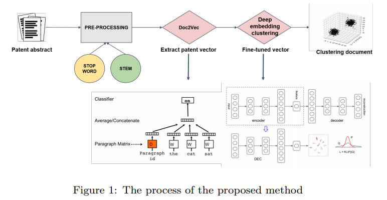
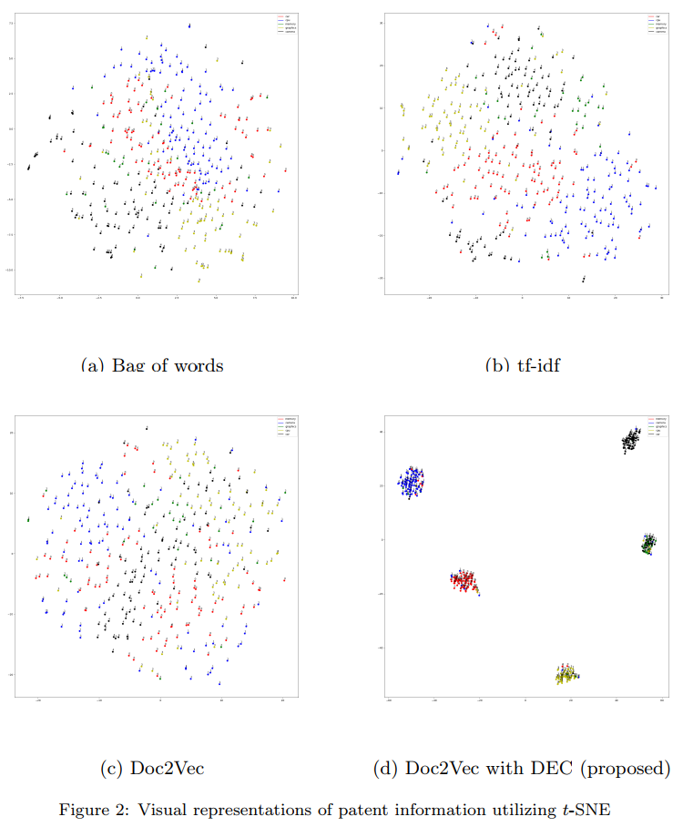
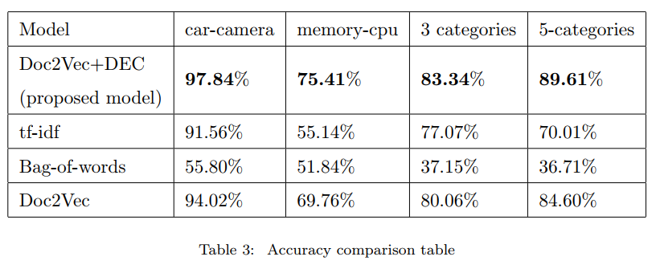

# Patent Document Clustering with Deep Embeddings

Code for the paper

**PDCDE : Patent Document Clustering with Deep Embeddings**  
Jaeyoung Kim, Janghyeok Yoon, Eunjeong Park, Sungchul Choi  

https://www.researchgate.net/publication/325251122_Patent_Document_Clustering_with_Deep_Embeddings

## Dataset

* [KIPRIS](http://www.kipris.or.kr/khome/main.jsp) dataset  
    - KIPRIS dataset consists of abstracts from five categories of US patent
    - Categories : car, cameras, CPUs, memory, graphics.  
    
* The combination used in the paper
    
    - Task 1 : car-camera(Less relevant class)
    - Task 2 : memory-cpu(Relevant classes)
    - Task 3 : car, camera, cpu, memory, graphics.
        

## Results

#### Visualization

#### Unsupervised accuracy

* 3 categories task is used [KISTA](http://biz.kista.re.kr/patentmap) dataset, 
we will add this dataset soon.

## Prerequisites

* Tensorflow 1.4.0
* Keras 2.2.0
* nltk 3.3
* pandas 0.23.0
* scikit-learn 0.19.1

## Usage

#### Requirment

~~~
#python2
$ pip install -r requirments.txt

#python3
$ pip3 install -r requirments.txt
~~~

#### Embedding patent abstract from scratch
* **category : car_camera, memory_cpu, 5_categories**

~~~
$ python embedding_patent.py --dataset "category"
~~~  

#### Train DEC

~~~
$ python train.py --dataset "category"
~~~

#### To test with an existing model

~~~
$ python train.py --dataset "category" --task test
~~~

##### **Common Options**

* `dataset` : categories of dataset. you can select `{"car_camera", "memory_cpu", "5_categories"}`
* `save_embedding_vector` : path to the embedding vectors.
* `save_weight_path` : path to the trained weight.
* `dataset_path` : path to KPRIS dataset. Default is `./dataset`

##### **Doc2Vec Options**

* `window_size` : Doc2Vec window size. Default is `5`.
* `embedding_size` : Embedding vector dimension. Default is `50`.
* `doc_initializer` : Doc2Vec word and document initializer. Default is `uniform`
* `negative_sample` : Number of negative sampling used0 nce loss. Default is `5`.
* `doc_lr` : Doc2Vec initial learning rate. Default is `0.01`.
* `doc_batch_size` : Doc2Vec batch size. Default is `256`.
* `doc_epochs` : Doc2Vec epochs. Default is `500`.

##### **DEC Options**

* `dec_batch_size` : DEC model batch size. Default is `256`
* `dec_lr` : DEC initial learning rate. Default is `0.001`
* `dec_decay_step` : step decay every **n** epochs.
* `layerwise_pretrain_iters` : layerwise weight pretrain iterations(greedy layer wise auto encoder).
Default is `5000`.
* `finetune_iters` : fine-tunning iteration after layerwise weights pretrain.
Default is `5000`.